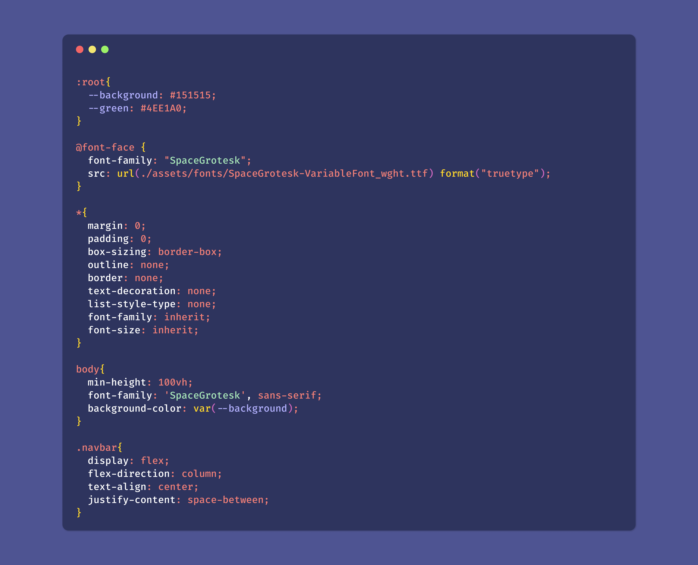

# TheCoderGuru

Let's face it, we are all work on code on a day to day basis and sometimes late at night, 
hence its best to have a theme that enables productivity during the night and helps you be productive.

I took inspiration from Dracula Theme and then tweaked the colors around to achieve this desired theme.

 

**This theme will be maintained and updated as I have time.**

 

I hope you enjoy using this theme and it helps you in some way or the other.

Cheers and happy coding

 

## Screenshots

 

HTML

 

 

CSS

 

 

JS

 

## Color Reference

#### UI Colors

| Color | Usage
|-------| ----- |
 `#3D405B` | Editor Background
 `#202235` | Activity Bar Badge Background
 `#8a8eab` | Activity Bar Inactive Background
 `#b7b9cf` | Sidebar Title Foreground
 `#282b40` | Editor Group Header Tabs Background
 `#adbaee` | Git Decoration Modified Resource Foreground
 `#9b9db1` | Editor Line Number Foreground
 `#2a2c3f` | List Inactive Selection Background
 `#2b2e45` | Minimap Background
 `#8f92ab8b` | Minimap Slider Active Background
 `#535882` | Diff Editor Gutter Inserted Line Background

### Syntax Colors

| Color | Usage
|-------| ----- |
 `#9491bd`| Comments
  `#ccbefe`| Variables
  `#FF5370`| Invalid
  `#d0aee6`| Keyword, Storage
  `#ddd2d2`| Operator, Misc
  `#83f3ce`| Logical Properties
  `#92b4ed`| Tag
  `#e7d190`| Function, Special Method
  `#a1d1ea`| Block Level Variables
  `#f07178`| Other Variable, String Link
  `#eaa18f`| Number, Constant, Function Argument, Tag Attribute, Embedded
  `#dcf3b9`| String, Symbols, Inherited Class, Markup Heading
  `#b7fad7`| Class, Support
  `#B2CCD6`| Entity Types
  `#c4ccdb`| CSS Class and Support
  `#82AAFF`| meta.method.js
  `#f8a2ac`| Attributes
  `#FFCB6B`| HTML Attributes
  `#f39b7e`| CSS Classes
  `#FFCB6B`| HTML Attributes

## Theming Reference

[VS Code Theme Color Reference](https://code.visualstudio.com/docs/getstarted/theme-color-reference)

[VS Code Theme Documentation](https://code.visualstudio.com/docs/extensions/themes-snippets-colorizers)

[VS Code Publishing Extensions](https://code.visualstudio.com/docs/extensions/publish-extension)

[VS Code Color Theme](https://code.visualstudio.com/api/extension-guides/color-theme)

## Installation via VS Code

1. Open **Extensions** sidebar panel in VS Code. `View -> Extensions`
2. Search for `TheCoderGuru Dark`
3. Click **Install** to install it
4. Click **Reload** to reload the editor
5. Code -> Preferences -> Color Theme -> **TheCoderGuru Dark**

## Manual Installation

Read the [VSC Extension Quickstart Guide](https://github.com/TheCoderGuru/thecoderguru_dark/blob/main/vsc-extension-quickstart.md)
